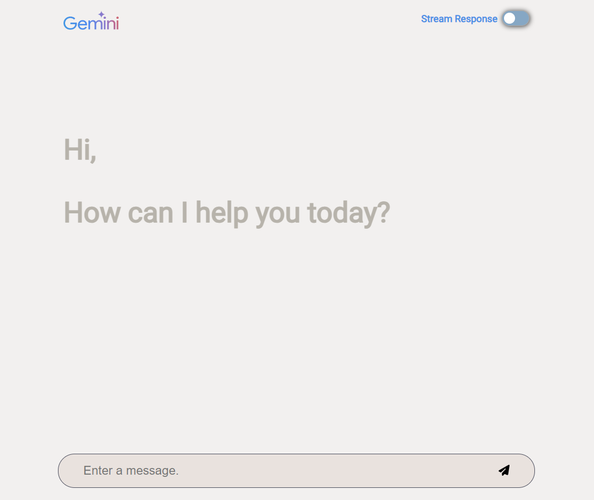
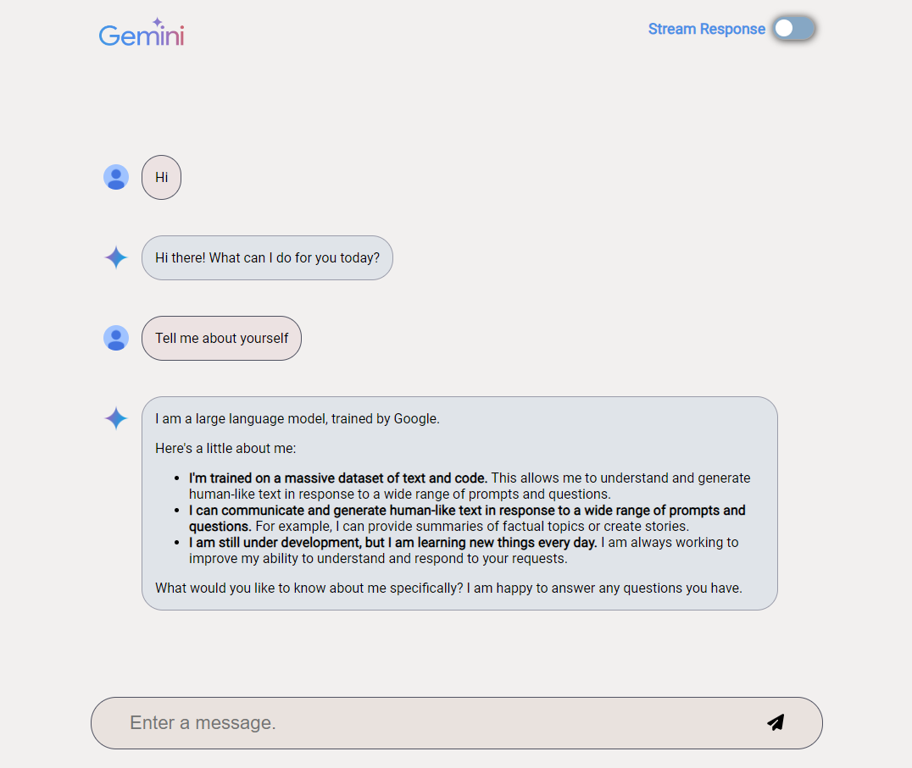

# Gemini chat app
<p float="left">
  
   
</p>

## Table of Contents

- [Intro](#intro)
- [API documentation](#api-documentation)
- [Installation](#installation)
  - [Using bash script for Node.js/Flask on Linux/macOS](#using-bash-script-for-nodejsflask-on-linuxmacos)
  - [Install manually(Linux/macOS/Windows)](#install-manuallylinuxmacoswindows)
    - [nvm(Node Version Manager) installation](#nvmnode-version-manager-installation)
    - [Node.js installation](#nodejs-installation)
    - [Flask installation](#flask-installation)
    - [Go installation](#go-installation)
- [Run the app](#run-the-app)
  - [Run React client](#run-react-client)
  - [Run backend server](#run-backend-server)
    - [Configure and run Node.js backend](#configure-and-run-nodejs-backend)
    - [Configure and run Python/Flask backend](#configure-and-run-pythonflask-backend)
    - [Configure and run Go backend](#configure-and-run-go-backend)
- [Usage](#usage)

## Intro
This chat app allows the user to converse with Gemini and use it as an intelligent, personal AI assistant.
Two modes of text-only chat are currently available in this app, non-streaming and streaming.

In non-streaming mode, a response is returned after Gemini completes the entire text generation process.

Streaming mode uses Gemini's streaming capability to achieve faster interactions.

### Frontend 
The client for this app is written using [React](https://react.dev/) and served using [Vite](https://github.com/vitejs/vite).

### Backend
The app currently has 3 different backend servers that the user can choose from, [Flask](https://flask.palletsprojects.com/en/3.0.x/quickstart/), [Node.js](https://Node.js.org/en) or [Go](https://go.dev)

## API documentation
### Endpoints available
<table class="responsive fixed orange">
<colgroup><col width="214px"><col></colgroup>
<tr><th><h3 class="add-link">Endpoint</h3></th>
<th><h3 class="add-link">Details</h3></th></tr>
<tr>
<td>
<code>chat/</code>
</td>
<td>
This is the <b>non-streaming</b> POST method route. Use this to send the chat message and the history of the conversation to the Gemini model. The complete response generated by the model to the posted message will be returned in the API's response.  
<br />
<br />
<code>POST</code> <code><b>chat/</b></code>
<h4>Parameters</h4>
<table class="responsive fixed orange">
<tr><td><h5>Name</h5></td><td><h5>Type</h5></td><td><h5>Data type</h5></td><td><h5>Description</h5></td></tr>
<tr><td>chat</td><td>required</td><td>string</td><td>Latest chat message from user</td></tr>
<tr><td>history</td><td>optional</td><td>array</td><td>Current chat history between user and Gemini model</td></tr>
</table>
<h4>Response</h4>
<table class="responsive fixed orange">
<tr><td><h5>HTTP code </h5></td><td><h5>Content-Type</h5></td><td><h5>Response</h5></td></tr>
<tr><td>200</td><td>application/json</td><td>{"text": string}</td></tr>
</table>
</td>
</tr>
<tr>
<td>
<code>stream/</code>
</td>
<td>
This is the <b>streaming</b> POST method route. Use this to send the chat message and the history of the conversation to the Gemini model. The response generated by the model will be streamed to handle partial results.  
<br />
<br />
<code>POST</code> <code><b>stream/</b></code>
<h4>Parameters</h4>
<table class="responsive fixed orange">
<tr><td><h5>Name</h5></td><td><h5>Type</h5></td><td><h5>Data type</h5></td><td><h5>Description</h5></td></tr>
<tr><td>chat</td><td>required</td><td>string</td><td>Latest chat message from user</td></tr>
<tr><td>history</td><td>optional</td><td>array</td><td>Current chat history between user and Gemini model</td></tr>
</table>
<h4>Response</h4>
<table class="responsive fixed orange">
<tr><td><h5>HTTP code </h5></td><td><h5>Content-Type</h5></td><td><h5>Response</h5></td></tr>
<tr><td>200</td><td>application/json</td><td>string</td></tr>
</table>
</td>
</tr>
</table>

## Installation
Click [here](#windows) to skip to installation on Windows.

If your choice of backend is Node.js or Flask, for Linux/macOS a setup bash script is available for easy installation. The bash script does not support installation of Go. If you wish to use Go as your backend or prefer installing manually, you can skip to the [next section](#install-manuallylinuxmacoswindows).
### Using bash script for Node.js/Flask on Linux/macOS
#### Make the script executable
```
chmod +x setup.sh
```
#### Installation options

You can choose to install the required packages for
- Frontend(React) plus a backend server of your choice(Flask or Node.js).
- Frontend(React) and both backend servers(Flask, and Node.js).

You can specify your choice using the `BACKEND` variable while running the script.

Install React along with Node.js backend.
```
BACKEND=nodejs ./setup.sh
```

Install React along with Python/Flask backend.
```
BACKEND=python source ./setup.sh
```

Install React along with both(Flask, and Node.js) backends.
```
BACKEND=all source ./setup.sh
```

### Install manually(Linux/macOS/Windows)

#### nvm(Node Version Manager) installation

##### Linux/macOS
```
curl -o- https://raw.githubusercontent.com/nvm-sh/nvm/v0.40.1/install.sh | bash

export NVM_DIR="$HOME/.nvm"
[ -s "$NVM_DIR/nvm.sh" ] && \. "$NVM_DIR/nvm.sh"  # This loads nvm
[ -s "$NVM_DIR/bash_completion" ] && \. "$NVM_DIR/bash_completion"  # This loads nvm bash_completion
```
##### Windows
Visit official [npm docs](https://docs.npmjs.com/downloading-and-installing-node-js-and-npm#windows-node-version-managers) for installation instructions.

#### Node.js installation
##### Linux/macOS/Windows

Install version **22.6.0** of node.
```
nvm install 22.6.0
```
##### Install the package dependencies for Node.js
You can quickly install the required packages using the `package.json` file. 
1. Navigate to the app directory, `server-js` (i.e. where `package.json` is located).
2. Run `npm install`. This will install all the required packages mentioned in `package.json`.

#### Flask installation

##### Create a new virtual environment.
###### Linux/macOS
   ```
   python -m venv venv
   source .venv/bin/activate
   ```

###### Windows
   ```
   python -m venv venv
   .\venv\Scripts\activate
   ```

##### Install the required Python packages.
###### Linux/macOS/Windows
```
pip install -r requirements.txt
```

#### Go installation

Check if Go is already installed on your system.
```
go version
```
If Go is not installed, follow the instructions for your operating system from the [official Go installation guide](https://go.dev/doc/install).

## Run the app
To launch the app you have to perform the following steps:
1. Run React client
2. Run the backend server of your choice(Flask or Node.js)

### Run React client
1. Navigate to the app directory, `client-react/`.
2. Run the application with the following command:

```
npm run start
```
The client will start on `localhost:3000`.

### Run backend server
#### Grab an API Key

Before you can use the Gemini API, you must first obtain an API key. If you don't already have one, create a key with one click in Google AI Studio.  

<a class=button button-primary href=https://ai.google.dev/gemini-api/docs/api-key target=_blank rel=noopener noreferrer>Get an API key</a>

Refer to the instructions for your choice of backend in the following section.

##### Configure and run Node.js backend
###### Configuration
1. Navigate to the app directory, `server-js/`.
2. Copy the `.env.example` file to `.env`.
```
cp .env.example .env
```
3. Specify the Gemini API key for the variable `GOOGLE_API_KEY` in the `.env` file.
```
GOOGLE_API_KEY=<your_api_key>
```

###### Running the Application
To run the Node.js chat app, use the following command.

```
node --env-file=.env app.js
```

`--env-file=.env` tells node.js where the .env file lies.

By default, the app will run on port 9000.

To specify a custom port, edit the `PORT` key in your `.env` file,
`PORT=xxxx`.

** Note: ** In case of a custom port, you must update the host URL in [React App.js](frontend/src/App.js#L36).

##### Configure and run Python/Flask backend
###### Configuration
1. Navigate to the app directory, `server-python/`.
2. Copy the `.env.example` file to `.env`.
```
cp .env.example .env
```
3. Specify the Gemini API key for the variable `GOOGLE_API_KEY` in the `.env` file.
```
GOOGLE_API_KEY=<your_api_key>
```

###### Running the Application
Run the application with the following command.

```
python app.py
```
The server will start on `localhost:9000`.

##### Configure and run Go backend
###### Configuration
You need a Gemini API key to run the server,

If you don't have a Gemini API key ready, you can create a key with one click in [Google AI Studio](https://aistudio.google.com/app/apikey).
You must set the API key as an environment variable while running the application.

###### Running the Application
1. Navigate to the app directory, `server-go` (i.e. where main.go is located).
2. Run the application with the following command.
```
GOOGLE_API_KEY=<your_api_key> go run .
```
The server will start on `localhost:9000`.
By default, the server starts on port 9000. You can override the default port the server listens on by setting the environment variable `PORT` in the command above.

## Usage
To start using the app, visit [http://localhost:3000](http://localhost:3000/)


